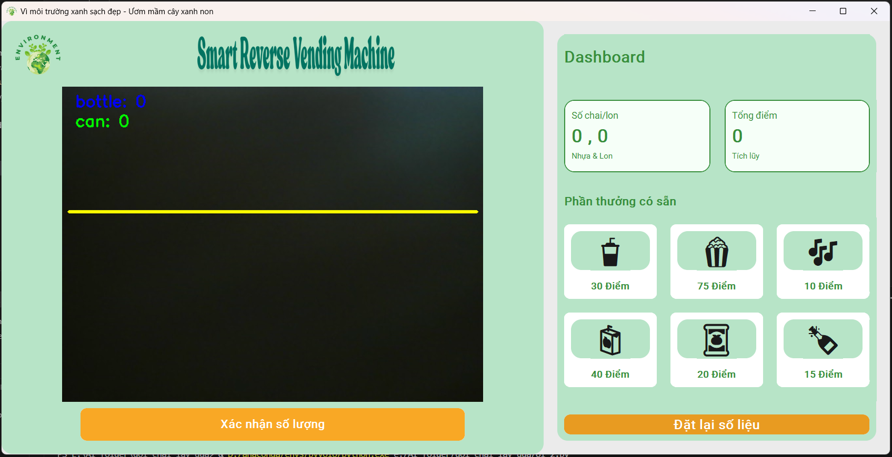

# 🌱 Smart Reverse Vending Machine - Máy Đổi Chai/Lon Tích Điểm Đổi Quà

## 1. Giới thiệu tổng quan

**Smart Reverse Vending Machine** là hệ thống mô phỏng máy thu gom chai/lon thông minh, tích điểm đổi quà vì môi trường xanh sạch. Ứng dụng sử dụng Python, giao diện hiện đại với [CustomTkinter], tích hợp AI (YOLO) nhận diện vật phẩm qua camera, quản lý điểm thưởng và đổi quà trực quan.

- **Mục tiêu:** Khuyến khích tái chế, nâng cao ý thức bảo vệ môi trường, tạo trải nghiệm tương tác vui vẻ, sinh động.
- **Ý nghĩa:** Mỗi chai/lon bạn bỏ vào là một điểm tích lũy, vừa bảo vệ môi trường vừa nhận quà hấp dẫn!

---

## 2. Hiệu ứng giao diện nổi bật

- **Splash Screen:** Màn hình chờ khởi động với ảnh động GIF, thanh tiến trình mượt mà, hiệu ứng phần trăm.
- **Tiêu đề động:** Tiêu đề dashboard đổi màu liên tục, tạo cảm giác sinh động, hiện đại.
- **Hộp thoại tuỳ chỉnh:** Xác nhận, thông báo, nhập tên xuất phiếu... đều có hiệu ứng bo góc, màu sắc thân thiện, hoàn toàn bằng tiếng Việt.
- **Dashboard trực quan:** Thống kê số chai/lon, tổng điểm, phần thưởng, nút reset, export phiếu, tất cả đều có hiệu ứng hover, bo góc lớn, màu xanh chủ đạo.
- **Hiển thị camera real-time:** Camera cập nhật liên tục, nhận diện vật phẩm trực tiếp.

---

## 3. Hướng dẫn cài đặt & chạy

### Yêu cầu hệ thống
- Python >= 3.8 (khuyên dùng 3.9)
- Thư viện: `customtkinter`, `opencv-python`, `pillow`, `ultralytics` (YOLO)

### Cài đặt
```bash
# Clone dự án
https://github.com/BaoHan1712/SmaReverse-Vending-Machine.git
cd SmaReverse-Vending-Machine

# Cài đặt thư viện
pip install -r requirements.txt
```

### Chạy ứng dụng
```bash
python UI.py
```

- Đảm bảo có webcam hoặc file video mẫu trong thư mục `data/`.
- Đặt file model YOLO vào `model/best.pt` (có sẵn mẫu).
- Đặt logo, ảnh splash vào thư mục `image/` (nếu thiếu sẽ có placeholder).

---

## 4. Chức năng chính & luồng xử lý

- **Khởi động:** Hiện splash screen, load model, khởi tạo camera.
- **Giao diện chính:**
  - **Camera:** Hiển thị hình ảnh thực tế, nhận diện chai/lon.
  - **Xác nhận số lượng:** Nhấn nút để cộng dồn số chai/lon vừa nhận diện, cập nhật dashboard.
  - **Tích điểm:** Mỗi chai/lon được cộng 5 điểm.
  - **Đổi quà:** Nhấn vào phần thưởng, xác nhận để trừ điểm và nhận quà.
  - **Export phiếu:** Nhập tên, xuất phiếu tích điểm (có thể mở rộng lưu file).
  - **Reset số liệu:** Đặt lại toàn bộ số liệu, có xác nhận.
  - **Thoát:** Đóng cửa sổ an toàn, dừng luồng AI.

---

## 5. Cấu trúc file & vai trò

```
.
├── UI.py           # File giao diện chính, xử lý toàn bộ luồng UI, hiệu ứng, dashboard
├── backend_count.py# Xử lý AI YOLO, đếm vật phẩm, luồng xử lý riêng tránh treo UI
├── get_library.py  # Các hàm thư viện hỗ trợ (tiện ích, xử lý ảnh...)
├── get_zone.py     # Chọn vùng trên video, hỗ trợ debug/training
├── image/          # Ảnh logo, splash, demo UI
├── model/          # Chứa file model YOLO (best.pt)
├── data/           # Video mẫu, dữ liệu test
├── sumary/         # Tài liệu mô tả cảm biến, báo cáo
```

---

## 6. Mô tả các hàm quan trọng

### UI.py
- `CustomDialog`: Hộp thoại xác nhận/thông báo tuỳ chỉnh, bo góc, màu sắc đẹp.
- `RecyclingApp`: Lớp chính giao diện, quản lý toàn bộ luồng xử lý, dashboard, camera, điểm, phần thưởng.
  - `setup_left_frame`: Thiết lập khung trái (camera, logo, nút xác nhận).
  - `setup_right_frame`: Thiết lập dashboard, phần thưởng, nút reset, export.
  - `update_camera_feed`: Cập nhật hình ảnh camera liên tục.
  - `confirm_and_update_stats`: Xác nhận số lượng vật phẩm mới, cộng điểm.
  - `prompt_export`: Hộp thoại nhập tên, xuất phiếu tích điểm.
  - `prompt_reset_stats`: Hộp thoại xác nhận reset số liệu.
  - `prompt_redeem_reward`: Đổi quà, xác nhận, trừ điểm.
  - `update_dashboard_display`: Cập nhật lại dashboard khi có thay đổi.
- `create_splash_screen`: Tạo màn hình splash động khi khởi động.

### backend_count.py
- `YOLOProcessor`: Luồng riêng xử lý AI YOLO, nhận diện vật phẩm, đếm số lượng, truyền kết quả về UI qua queue.

### get_zone.py
- `run_video_selection`: Chọn vùng trên video, hỗ trợ debug/training, lưu toạ độ điểm.

---

## 7. Hình ảnh minh họa & ví dụ sử dụng

### Giao diện chính


### Logo & Splash


---

## 8. Đóng góp & liên hệ

- Mọi ý kiến đóng góp, báo lỗi hoặc đề xuất tính năng mới đều được hoan nghênh!
- Liên hệ: [BaoHan1712] (github.com/BaoHan1712)

---

> "Mỗi chai/lon bạn bỏ vào là một mầm xanh cho Trái Đất!" 